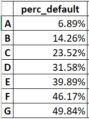

# Lending-Club-Data-driven-investment-strategy

In this project, we used Lending Club's rich data source of historical transactions to select which loans to invest inorder to maximise the customer's returns on those investments. 
We referred to Lendind Club's data - which is a Peer-to-peer lending platform. Peer-to-peer lending refers to the practice of lending money to individuals (or small businesses) via online platforms that match anonymous lenders (or investors) with borrowers. Lenders typically earn higher returns relative to investment products offered by banks. However, there is of course the risk that the borrower defaults on his or her loan.

The intermediary platform (such as Prosper or LendingClub) generates revenue by collecting fees on funded loans (from borrowers) as well as on servicing (from investors). The peer-to-peer lending industry in the United States started around 2006 and by 2012, LendingClub was the largest peer-to-peer lender based on issued loan volume and revenue. Peer-to-peer lending has been one of the fastest growing investments, with ∼16 billion in
loans reportedly originating from LendingClub by the end of 2015.

### Data
The dataset contains more than hundred features, including the following, for each loan:
1. Loan amount
2. Interest rate
3. Monthly installment amount
4. Demographic data - several additional attributes about the borrower (type of house ownership, annual
income, monthly FICO score, debt-to-income ratio, number of open credit lines, etc.)
5. Loan status (e.g., fully paid, default, charged-off)

High level data categories:

*Borrower Profile metrics/demographics*: Metrics describing the profile of the borrower
annual_inc, purpose, zip_code, emp_title, home_ownership, acc_now_delinq, addr_state, verification_status, emp_length, emp_title, emp_length, fico_range_low, fico_range_high 
*Temporal Metrics*: Metrics relating to time
mths_since_last_major_derog, mthsSinceLastDelinq, earliest_cr_line 
*Loan metrics*: Metrics defining the loan status and loan terms. 
fundedAmnt, loanAmnt, term, url, effective_int_rate, installments, grade, sub_grade, title, purpose, loan_status, total_pymnt, last_pymnt_amnt 
*Categorical Metrics*: Metrics which takes value from a fixed set 
Loan grade, employment Status, Loan Status, Verification status etc. 
*Continuous Metrics*: Numerical metrics 
num_op_rev_tl,num_rev_tl_bal_gt_0, num_sats, etc

### Business Understanding - Phase 1

- As an investor, the investor will have to decide the following:
    -decide the total amount I am willing to invest in Lending Club. 
    -deciding on the loan portfolio on Lending Club (deciding between a risk-seeking v/s risk-averse strategy, preference for higher interest rates or lower risk,    
     duration) 
 - The investor's objective will be to maximize my profits (returns) and minimize the likelihood (and potential amount) of losses. 
     
 - The first decision of deciding the total amount of money an investor is willing to invest in Lending Club is a personal one. It will not be influenced by the available data from Lending Club. Rather, the investor's financial history, current investments in other financial vehicles, expected future expenses & cash flows will determine the total amount the investor is comfortable in investing. 
 
- Deciding the loan portfolio will be informed using the data from LendingClub, as information like the borrower’s credit score, loan grade, debt-to-income ratio will help me determine the risk attached with each investment, and thereby come up with an optimal investment that will maximize profits. 

-The different times during which different loans are defaulted will impact the investor's decision-making and downstream analysis. Specifically, he/she will face bigger losses if the borrower is expected to default immediately after approval. This will be any investor's least preferred option. Contrast this with loans that are defaulted close to the end of the loan term. In this case, investor's losses will be lesser/minimal and he/she would prefer it over the earlier scenario. Therefore, we think investor's decision will vary depending on whether he/she want my investment back sooner or if he/she has the bandwidth to wait for more gains. 

- The return on Investment (ROI) is the most important for an investor. Features like grade, loan period, loan amount, interest rate, total payment can help determine ROI. Each of these variables can be combined in an appropriate way to compute the “return” for a given investor. 

- We think the historical data would be helpful for making such decisions. Historical data would help us in identifying characteristics of loan defaulters without any bias due to the time period considered for the analysis. Eg: Considering only the recent data from 2020 might have more defaults due the job losses during covid, such biases can be avoided using historical data. 

### Exploratory Data Analysis, Feature selections and Outlier detection - Phase 2

- We can partition our historical data into 2 halves. One will help us infer meaningful relationships/patterns between the status of the loan and the different features we have (like the demographic data, borrower financial history etc.). We can then use this information to develop investment strategies and test them out on the second half of the data to understand if our hypothesis/“learnings” are helping us maximize our returns (“better” decisions) vs minimizing them (“worse” decisions).
 
- Using all of the provided features will not be a good idea as some features will have a very high number of missing values (like annual_inc_joint, hardship_type, sec_app_collections_12_mths_ex_med, sec_app_fico_range_high). Some features could be highly correlated with each other, introducing multicollinearity in our data (For ex: FICO score and total_il_high_credit_limit could be correlated with each other). Some of the provided features might not be available to our model at the time of testing. Therefore, it would not make sense to use those features at the time of training the model. Ex: total_pymnt will not be available at the time of testing. Also, features like loan_id (basically, all unique identification features) would not have a good predictive power as they are just unique identifiers. 

- Loan grade and Fico score are likely to be correlated as individuals with higher fico score indicates the individuals have a higher tendency to repay debts, hence are given higher loan grades. It is also possible that the loan_status and total_payment would be related to each other as for the same loan amount, if it has defaulted, it is more likely to have a lower total_payment than it would have if it was completely paid off. 

- We cannot use the features as they are, because features having missing values will need to be imputed, categorical features will need to be encoded (like using one-hot encoding), features would need to be scaled/standardized (using StandardScaler, MinMax Scaler etc.). 

- At first look, total_pymnt does not seem to be related to the loan status because a low total_pymnt cannot be compared across different loan listings. We also need information on the total loan amount (for a particular loan listing) to be able to deduce the status based on the total_pymnt. 
However, making a few assumptions like considering the same loan amount (keeping all other metrics fixed), it is also possible that the loan_status and total_payment would be related to each other. Ex: For the same loan amount, if it has defaulted, it is more likely to have a lower total_payment than it would have if it was completely paid off. 

-Total_pymnt refers to the total payment received to date. We should not use total_pymnt while training a model because total_pymnt will not be available to the model at the time of testing. Including this feature during training will lead to data leakage. 

#### Calculating Returns on Past historical loans 

 

